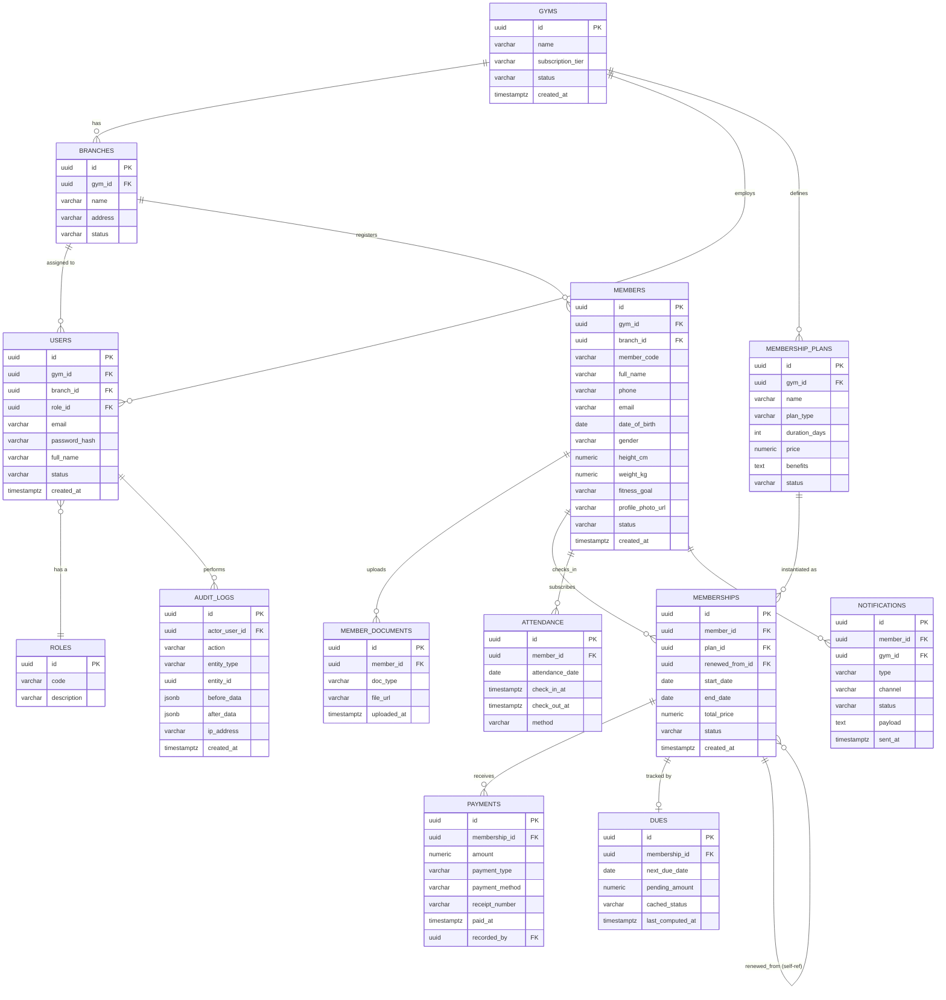

# Database Design — Gym Management Platform (PostgreSQL)

## 1. ER Diagram (Mermaid)



## 2. Design Notes

- **All PKs are UUID** (`gen_random_uuid()`, via `pgcrypto` extension) — safe for multi-tenant export/merge and avoids sequential-ID enumeration.
- **Multi-tenancy**: `gym_id` is denormalized onto `members`, `users`, `membership_plans`, `notifications` (and reachable via join for `memberships`/`payments`/`attendance`) so every tenant-scoped query can filter with a single indexed column rather than multi-hop joins.
- **`dues` table** holds the *cached* Smart Due Engine output (refreshed by nightly job + on payment write) for fast list/filter/search; the *authoritative* computation is always re-derivable from `memberships` + `payments` (see `DueEngineService`, ARCHITECTURE.md §2.3). This is a read-optimization, not a second source of truth — `dues` rows are always rebuildable from scratch.
- **`memberships.renewed_from_id`** self-references the prior membership row, forming a renewal chain (`status = 'RENEWED'` is set on the old row when a new one is created from it).
- **Soft deletes**: `members`, `users`, `branches`, `gyms`, `membership_plans` use a `status` enum including `INACTIVE`/`DELETED` rather than physical deletes — audit and historical-payment integrity depend on members never disappearing.
- **Payments are immutable**: no `UPDATE`/`DELETE` allowed at the application layer (enforced in service layer + a `BEFORE UPDATE/DELETE` trigger raising an exception, except for a privileged `is_reversed` flag set by a compensating `payment_adjustments` flow if needed later).

## 3. Full DDL (Flyway `V1__init.sql`)

```sql
CREATE EXTENSION IF NOT EXISTS pgcrypto;

-- ============ ROLES ============
CREATE TABLE roles (
    id          UUID PRIMARY KEY DEFAULT gen_random_uuid(),
    code        VARCHAR(30) NOT NULL UNIQUE,       -- SUPER_ADMIN, GYM_ADMIN, TRAINER
    description VARCHAR(255)
);

-- ============ GYMS ============
CREATE TABLE gyms (
    id                  UUID PRIMARY KEY DEFAULT gen_random_uuid(),
    name                VARCHAR(150) NOT NULL,
    subscription_tier   VARCHAR(30) NOT NULL DEFAULT 'STANDARD',
    status              VARCHAR(20) NOT NULL DEFAULT 'ACTIVE'
                          CHECK (status IN ('ACTIVE','SUSPENDED','DELETED')),
    created_at          TIMESTAMPTZ NOT NULL DEFAULT now(),
    updated_at          TIMESTAMPTZ NOT NULL DEFAULT now()
);

-- ============ BRANCHES ============
CREATE TABLE branches (
    id          UUID PRIMARY KEY DEFAULT gen_random_uuid(),
    gym_id      UUID NOT NULL REFERENCES gyms(id) ON DELETE CASCADE,
    name        VARCHAR(150) NOT NULL,
    address     VARCHAR(300),
    status      VARCHAR(20) NOT NULL DEFAULT 'ACTIVE'
                  CHECK (status IN ('ACTIVE','INACTIVE')),
    created_at  TIMESTAMPTZ NOT NULL DEFAULT now(),
    UNIQUE (gym_id, name)
);

-- ============ USERS (admins/super-admins) ============
CREATE TABLE users (
    id              UUID PRIMARY KEY DEFAULT gen_random_uuid(),
    gym_id          UUID REFERENCES gyms(id) ON DELETE CASCADE,      -- NULL for SUPER_ADMIN
    branch_id       UUID REFERENCES branches(id) ON DELETE SET NULL,
    role_id         UUID NOT NULL REFERENCES roles(id),
    email           VARCHAR(150) NOT NULL UNIQUE,
    password_hash   VARCHAR(255) NOT NULL,
    full_name       VARCHAR(150) NOT NULL,
    phone           VARCHAR(20),
    status          VARCHAR(20) NOT NULL DEFAULT 'ACTIVE'
                      CHECK (status IN ('ACTIVE','INACTIVE','LOCKED')),
    created_at      TIMESTAMPTZ NOT NULL DEFAULT now(),
    updated_at      TIMESTAMPTZ NOT NULL DEFAULT now()
);

-- ============ REFRESH TOKENS ============
CREATE TABLE refresh_tokens (
    id              UUID PRIMARY KEY DEFAULT gen_random_uuid(),
    user_id         UUID NOT NULL REFERENCES users(id) ON DELETE CASCADE,
    token_hash      VARCHAR(255) NOT NULL UNIQUE,
    device_info     VARCHAR(255),
    expires_at      TIMESTAMPTZ NOT NULL,
    revoked_at      TIMESTAMPTZ,
    created_at      TIMESTAMPTZ NOT NULL DEFAULT now()
);

-- ============ MEMBERS ============
CREATE TABLE members (
    id                  UUID PRIMARY KEY DEFAULT gen_random_uuid(),
    gym_id              UUID NOT NULL REFERENCES gyms(id) ON DELETE CASCADE,
    branch_id           UUID NOT NULL REFERENCES branches(id) ON DELETE RESTRICT,
    member_code         VARCHAR(30) NOT NULL,             -- human-readable, e.g. GYM001-0042
    full_name           VARCHAR(150) NOT NULL,
    phone               VARCHAR(20) NOT NULL,
    email               VARCHAR(150),
    date_of_birth       DATE,
    gender              VARCHAR(10) CHECK (gender IN ('MALE','FEMALE','OTHER')),
    height_cm           NUMERIC(5,2),
    weight_kg           NUMERIC(5,2),
    fitness_goal        VARCHAR(100),
    profile_photo_url   VARCHAR(500),
    status              VARCHAR(20) NOT NULL DEFAULT 'ACTIVE'
                          CHECK (status IN ('ACTIVE','INACTIVE','DELETED')),
    created_at          TIMESTAMPTZ NOT NULL DEFAULT now(),
    updated_at          TIMESTAMPTZ NOT NULL DEFAULT now(),
    UNIQUE (gym_id, member_code)
);

-- ============ MEMBER DOCUMENTS ============
CREATE TABLE member_documents (
    id          UUID PRIMARY KEY DEFAULT gen_random_uuid(),
    member_id   UUID NOT NULL REFERENCES members(id) ON DELETE CASCADE,
    doc_type    VARCHAR(50) NOT NULL,        -- ID_PROOF, MEDICAL_NOTE, OTHER
    file_url    VARCHAR(500) NOT NULL,
    uploaded_at TIMESTAMPTZ NOT NULL DEFAULT now()
);

-- ============ MEMBERSHIP PLANS ============
CREATE TABLE membership_plans (
    id              UUID PRIMARY KEY DEFAULT gen_random_uuid(),
    gym_id          UUID NOT NULL REFERENCES gyms(id) ON DELETE CASCADE,
    name            VARCHAR(100) NOT NULL,
    plan_type       VARCHAR(20) NOT NULL
                      CHECK (plan_type IN ('MONTHLY','QUARTERLY','HALF_YEARLY','ANNUAL','CUSTOM')),
    duration_days   INT NOT NULL CHECK (duration_days > 0),
    price           NUMERIC(10,2) NOT NULL CHECK (price >= 0),
    benefits         TEXT,
    status          VARCHAR(20) NOT NULL DEFAULT 'ACTIVE'
                      CHECK (status IN ('ACTIVE','INACTIVE')),
    created_at      TIMESTAMPTZ NOT NULL DEFAULT now(),
    UNIQUE (gym_id, name)
);

-- ============ MEMBERSHIPS ============
CREATE TABLE memberships (
    id                  UUID PRIMARY KEY DEFAULT gen_random_uuid(),
    member_id           UUID NOT NULL REFERENCES members(id) ON DELETE CASCADE,
    plan_id             UUID NOT NULL REFERENCES membership_plans(id) ON DELETE RESTRICT,
    renewed_from_id     UUID REFERENCES memberships(id) ON DELETE SET NULL,
    start_date          DATE NOT NULL,
    end_date            DATE NOT NULL,
    total_price         NUMERIC(10,2) NOT NULL CHECK (total_price >= 0),  -- snapshot of plan price at purchase
    status              VARCHAR(20) NOT NULL DEFAULT 'ACTIVE'
                          CHECK (status IN ('ACTIVE','DUE_SOON','OVERDUE','EXPIRED','RENEWED','CANCELLED')),
    created_at          TIMESTAMPTZ NOT NULL DEFAULT now(),
    updated_at          TIMESTAMPTZ NOT NULL DEFAULT now(),
    CHECK (end_date > start_date)
);

-- ============ PAYMENTS (immutable ledger) ============
CREATE TABLE payments (
    id              UUID PRIMARY KEY DEFAULT gen_random_uuid(),
    membership_id   UUID NOT NULL REFERENCES memberships(id) ON DELETE RESTRICT,
    amount          NUMERIC(10,2) NOT NULL CHECK (amount > 0),
    payment_type    VARCHAR(20) NOT NULL
                      CHECK (payment_type IN ('FULL','PARTIAL','ADVANCE')),
    payment_method  VARCHAR(20) NOT NULL
                      CHECK (payment_method IN ('CASH','CARD','UPI','BANK_TRANSFER','OTHER')),
    receipt_number  VARCHAR(50) NOT NULL UNIQUE,
    is_reversed     BOOLEAN NOT NULL DEFAULT FALSE,
    recorded_by     UUID NOT NULL REFERENCES users(id),
    paid_at         TIMESTAMPTZ NOT NULL DEFAULT now()
);

-- Enforce payment immutability at the DB layer (defense in depth alongside service-layer checks)
CREATE OR REPLACE FUNCTION prevent_payment_mutation() RETURNS TRIGGER AS $$
BEGIN
    RAISE EXCEPTION 'payments are immutable; use is_reversed flag via adjustment flow';
END;
$$ LANGUAGE plpgsql;

CREATE TRIGGER trg_payments_no_update
    BEFORE UPDATE ON payments
    FOR EACH ROW
    WHEN (OLD.is_reversed IS DISTINCT FROM NEW.is_reversed)
    EXECUTE FUNCTION prevent_payment_mutation();

CREATE TRIGGER trg_payments_no_delete
    BEFORE DELETE ON payments
    FOR EACH ROW
    EXECUTE FUNCTION prevent_payment_mutation();

-- ============ DUES (cached Smart Due Engine output) ============
CREATE TABLE dues (
    id                  UUID PRIMARY KEY DEFAULT gen_random_uuid(),
    membership_id       UUID NOT NULL UNIQUE REFERENCES memberships(id) ON DELETE CASCADE,
    next_due_date       DATE,
    pending_amount      NUMERIC(10,2) NOT NULL DEFAULT 0,
    cached_status       VARCHAR(20) NOT NULL
                          CHECK (cached_status IN ('ACTIVE','DUE_SOON','OVERDUE','EXPIRED','RENEWED')),
    last_computed_at    TIMESTAMPTZ NOT NULL DEFAULT now()
);

-- ============ ATTENDANCE ============
CREATE TABLE attendance (
    id              UUID PRIMARY KEY DEFAULT gen_random_uuid(),
    member_id       UUID NOT NULL REFERENCES members(id) ON DELETE CASCADE,
    attendance_date DATE NOT NULL,
    check_in_at     TIMESTAMPTZ NOT NULL,
    check_out_at    TIMESTAMPTZ,
    method          VARCHAR(20) NOT NULL DEFAULT 'MANUAL'
                      CHECK (method IN ('MANUAL','QR')),
    UNIQUE (member_id, attendance_date)   -- one session per member per day
);

-- ============ NOTIFICATIONS ============
CREATE TABLE notifications (
    id          UUID PRIMARY KEY DEFAULT gen_random_uuid(),
    gym_id      UUID NOT NULL REFERENCES gyms(id) ON DELETE CASCADE,
    member_id   UUID REFERENCES members(id) ON DELETE CASCADE,   -- NULL for broadcast/promotional
    type        VARCHAR(30) NOT NULL
                  CHECK (type IN ('DUE_REMINDER','RENEWAL_REMINDER','PAYMENT_CONFIRMATION','ATTENDANCE_ALERT','PROMOTIONAL')),
    channel     VARCHAR(20) NOT NULL CHECK (channel IN ('PUSH','SMS','EMAIL','IN_APP')),
    status      VARCHAR(20) NOT NULL DEFAULT 'PENDING'
                  CHECK (status IN ('PENDING','SENT','FAILED')),
    payload     JSONB,
    sent_at     TIMESTAMPTZ,
    created_at  TIMESTAMPTZ NOT NULL DEFAULT now()
);

-- ============ AUDIT LOGS ============
CREATE TABLE audit_logs (
    id              UUID PRIMARY KEY DEFAULT gen_random_uuid(),
    actor_user_id   UUID REFERENCES users(id),
    action          VARCHAR(50) NOT NULL,        -- CREATE, UPDATE, DELETE, LOGIN, etc.
    entity_type     VARCHAR(50) NOT NULL,
    entity_id       UUID,
    before_data     JSONB,
    after_data      JSONB,
    ip_address      VARCHAR(50),
    created_at      TIMESTAMPTZ NOT NULL DEFAULT now()
);
```

## 4. Indexing Strategy

| Table | Index | Reason |
|---|---|---|
| `members` | `(gym_id, branch_id)` | tenant + branch scoped list views |
| `members` | `(gym_id, member_code)` UNIQUE | search by member ID, already enforced via UNIQUE constraint |
| `members` | `(phone)` btree | search by phone |
| `members` | `to_tsvector('simple', full_name)` GIN | name search/autocomplete |
| `memberships` | `(member_id, status)` | "current membership" lookups |
| `memberships` | `(status, end_date)` | dashboard due/expired aggregations, nightly job scan |
| `payments` | `(membership_id, paid_at DESC)` | payment history timeline |
| `payments` | `(paid_at)` | revenue reports by date range |
| `dues` | `(cached_status, next_due_date)` | due-today/this-week/overdue list filters |
| `attendance` | `(member_id, attendance_date DESC)` | per-member history |
| `attendance` | `(attendance_date)` | daily/weekly attendance reports |
| `notifications` | `(gym_id, status, created_at)` | pending-notification dispatch queries |
| `audit_logs` | `(entity_type, entity_id)` | entity history lookup |
| `audit_logs` | `(actor_user_id, created_at)` | per-admin activity audit |
| `users` | `(gym_id, branch_id)` | tenant-scoped admin listing |

All FK columns get an implicit btree index via Postgres convention (explicitly declared in Flyway migration for documentation clarity, omitted above for brevity but included in the actual `V1__init.sql`).

## 5. Constraints Summary
- Referential integrity via FKs with deliberate `ON DELETE` semantics: `CASCADE` for strictly-owned children (branches, documents, attendance, notifications), `RESTRICT` for plans/payments/branches that must not silently vanish out from under historical records, `SET NULL` for optional links (`branch_id` on users, `renewed_from_id`).
- `CHECK` constraints enforce enum-like fields at the DB layer as a second line of defense behind application validation (Bean Validation annotations on DTOs).
- `UNIQUE (member_id, attendance_date)` prevents double check-in per day at the DB layer.
- `payments.receipt_number UNIQUE` plus immutability triggers protect the financial ledger from both duplication and tampering.

## 6. Migration Strategy
- Flyway versioned migrations only (`V{n}__description.sql`), applied automatically on backend startup in non-prod, gated behind a manual approval step in the CI/CD pipeline for prod (per ARCHITECTURE.md §5).
- Seed data (roles: `SUPER_ADMIN`, `GYM_ADMIN`, `TRAINER`) ships as `V2__seed_roles.sql`.
