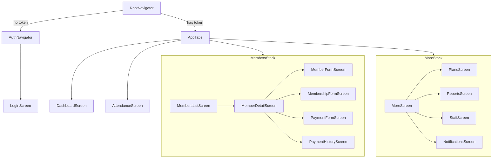
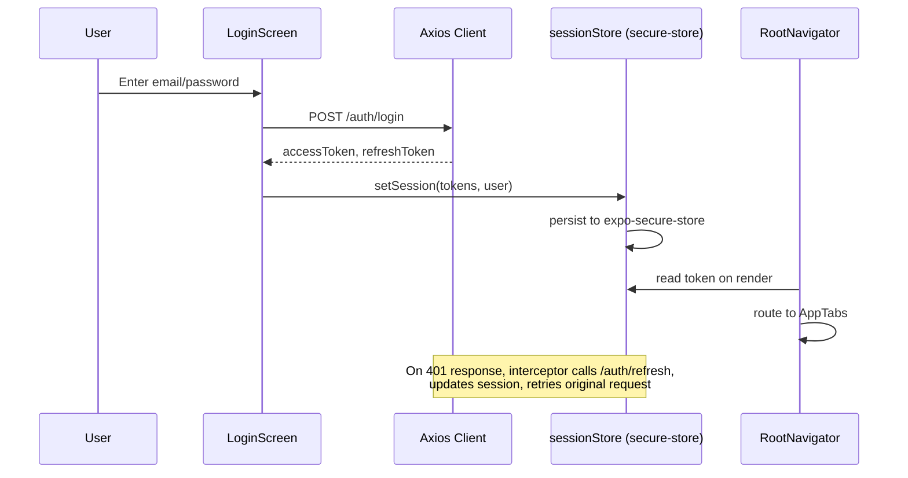
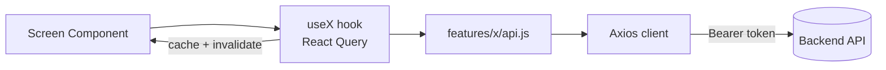

# Mobile App Design

React Native (Expo, JavaScript) client for the Gym Management Platform.

## Stack

- **Navigation**: `@react-navigation` (bottom tabs + native stacks)
- **Client state**: Zustand
- **Server state**: TanStack React Query
- **HTTP**: Axios
- **UI**: react-native-paper (Material Design 3)
- **Forms**: react-hook-form + Zod
- **Secure storage**: expo-secure-store (AsyncStorage fallback on web)

## Folder structure (`src/`)

```
api/            HTTP client (axios) + interceptors
components/     Shared UI: GradientHeader, StatCard, GlassCard, StatusBadge, InlineSelect
features/       Domain modules (api + hooks): auth, attendance, branches, dashboard,
                members, memberships, payments
screens/        Screen components, grouped by feature
navigation/     RootNavigator, AppTabs, MembersStack, MoreStack, AuthNavigator
store/          Zustand stores: sessionStore, themeStore, toastStore, secureStorage
theme/          Color tokens, light/dark theme config
utils/          Formatters
```

## Navigation

- **RootNavigator** gates the app: no auth token → `AuthNavigator` (Login only); token present → `AppTabs`.
- **AppTabs** (bottom tabs): Dashboard, Members (→ stack), Attendance, More (→ stack).
- **MembersStack**: List → Detail → MemberForm / MembershipForm / PaymentForm / PaymentHistory.
- **MoreStack**: Home → Plans / Reports / Staff / Notifications.



## State & data

- **Zustand** for client state — `sessionStore` (tokens/user, hydrated from secure storage on launch), `themeStore` (dark mode), `toastStore` (global toasts).
- **React Query** for all server reads/writes — each feature exposes `useX` hooks (`useQuery` for fetches, `useMutation` for create/update/delete) with cache invalidation on mutation success.
- **Axios client**: base URL from `EXPO_PUBLIC_API_BASE_URL` / `app.json`, request interceptor injects Bearer token, response interceptor auto-refreshes on 401.

## Auth flow

1. Login screen (email/password, Zod-validated) calls `useLogin()` mutation.
2. Tokens (access + refresh) stored via `expo-secure-store`.
3. `App.js` hydrates session from secure storage on startup.
4. `RootNavigator` routes based on token presence.
5. Logout clears store + secure storage.



## Data flow (feature module pattern)



## Conventions

- Forms standardized on react-hook-form + Zod across the app.
- Material Design 3 theming (light/dark), brand colors `#2563EB` (primary) / `#10B981` (secondary), status-colored badges for membership states.
- Charts via `react-native-gifted-charts`.
